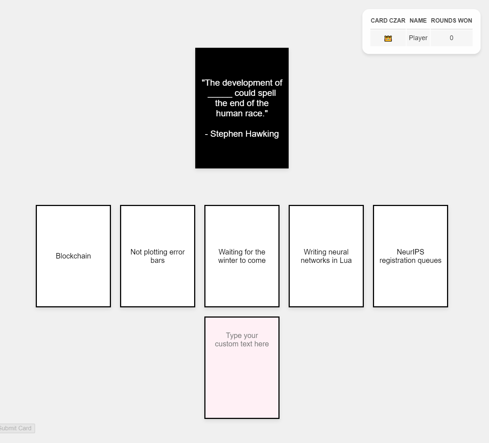

# 🃏 Alchemy with Friends - Online 🎭

## 🌟 Introduction
Welcome to my "Alchemy with Friends - Online" game! This project started as a fun way to play [Microsoft's Alchemy with Friends](https://www.microsoft.com/en-us/research/uploads/prod/2020/11/Alchemy-with-Friends-Print-at-Home-2020.pdf) with my friends over the internet. However, it can be used to play with any (manually inserted) cards for a fill-in-the-blank style game, similar to popular party games.

## 🃏 Cards
Cards have been copied from [Microsoft's Alchemy with Friends](https://www.microsoft.com/en-us/research/uploads/prod/2020/11/Alchemy-with-Friends-Print-at-Home-2020.pdf), including the [Expansion Pack](https://www.microsoft.com/en-us/research/uploads/prod/2020/06/Alchemy-with-Friends-ML-Expansion-Pack.pdf) and the [Visionary Edition](https://www.microsoft.com/en-us/research/uploads/prod/2020/06/Alchemy-with-Friends-CV-Expansion-Pack.pdf). However, the `Backend/cards.json` file can be edited to contain whatever cards you desire.

Please let me know if Microsoft has released other expansion packs or related card games!

## 🚀 Features
- Real-time multiplayer gameplay using WebSockets
- Customizable card decks
- Scoreboard resilient to server crashes
- Blank cards for the user to fill in (use at your own risk, edit `INCLUDE_BLANK_CARDS` in `Backend/main.py` to turn them off)

## ⚠️ Disclaimer
This is a quick project to explore AI-assisted web development. **Please note:** This project should not be hosted in any serious setting as players may be able to manipulate their data and send it to the server. 

The code is not indicative of my web development skills (because it's a mess), but simply to see:
* how far along the technology is to make functional game sites, and
* how quickly I can cobble together an online card-game to enjoy with friends

## 🛠️ Technology Stack
- Frontend: HTML, CSS, JavaScript
- Backend: Python with Flask and Flask-SocketIO
- Real-time Communication: WebSockets

## 🧠 AI Assistance
- Originally written with the help of GitHub Copilot
- Rewritten using [aider](https://aider.chat) to implement WebSockets (using `claude-3-5-sonnet-20240620`) as Copilot's frequent polling was difficult to debug

## 🎮 How to Play
### 1. Clone the repository
### 2. Set up the backend server
1. Install the dependencies
2. Run the `main.py` server.
3. Make it so that the internet can see your server with the port you defined. Personally I used [localtunnel](https://localtunnel.me/) to expose my computer to the internet via the specified port (`lt --port 25565`). This prevents having to rent a VPS or port forward via your router.
### 3. Open the frontend in a web browser
To host my site for free I used [surge](https://surge.sh).
### 4. Invite your friends and enjoy!

## 🤝 Contributing
Feel free to fork this project and make your own improvements. Pull requests are welcome!

## 📜 License
This project is open-source and available under the MIT License.

## 🧙‍♂️ Icon
Icon taken from https://uxwing.com/witch-icon/.

Happy gaming! 🎉
